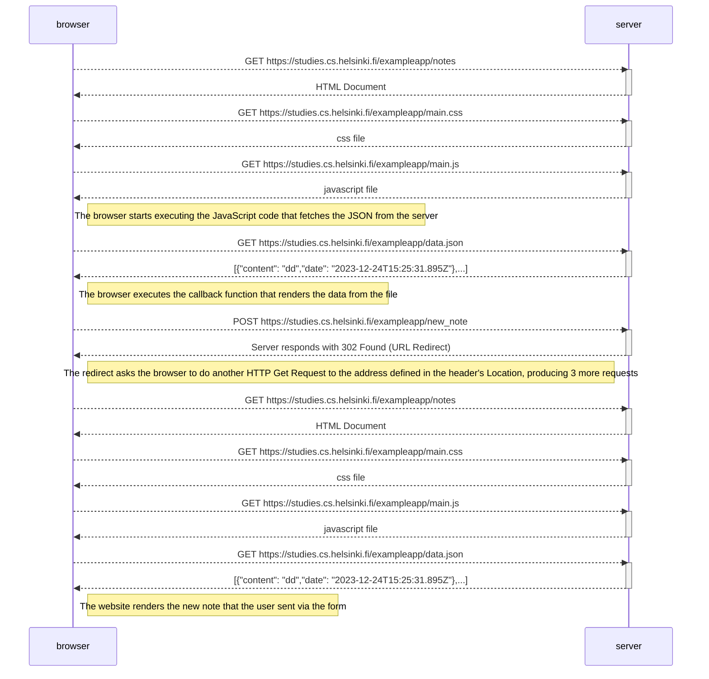

Exercise 0.4

```mermaid
sequenceDiagram
  participant browser
  participant server
  
  browser-->>server: GET https://studies.cs.helsinki.fi/exampleapp/notes
  activate server
  server-->>browser: HTML Document
  deactivate server

  browser-->>server: GET https://studies.cs.helsinki.fi/exampleapp/main.css
  activate server
  server-->>browser: css file
  deactivate server

  browser-->>server: GET https://studies.cs.helsinki.fi/exampleapp/main.js
  activate server
  server-->>browser: javascript file
  deactivate server

  Note right of browser: The browser starts executing the JavaScript code that fetches the JSON from the server

  browser-->>server: GET https://studies.cs.helsinki.fi/exampleapp/data.json
  activate server
  server-->>browser: [{"content": "dd","date": "2023-12-24T15:25:31.895Z"},...]
  deactivate server

  Note right of browser: The browser executes the callback function that renders the data from the file

  browser-->>server: POST https://studies.cs.helsinki.fi/exampleapp/new_note
  activate server
  server-->>browser: Server responds with 302 Found (URL Redirect)
  deactivate server

  Note right of browser: The redirect asks the browser to do another HTTP Get Request to the address defined in the header's Location, producing 3 more requests

  browser-->>server: GET https://studies.cs.helsinki.fi/exampleapp/notes
  activate server
  server-->>browser: HTML Document
  deactivate server

  browser-->>server: GET https://studies.cs.helsinki.fi/exampleapp/main.css
  activate server
  server-->>browser: css file
  deactivate server

  browser-->>server: GET https://studies.cs.helsinki.fi/exampleapp/main.js
  activate server
  server-->>browser: javascript file
  deactivate server

  browser-->>server: GET https://studies.cs.helsinki.fi/exampleapp/data.json
  activate server
  server-->>browser: [{"content": "dd","date": "2023-12-24T15:25:31.895Z"},...]
  deactivate server

  Note right of browser: The website renders the new note that the user sent via the form 

```
